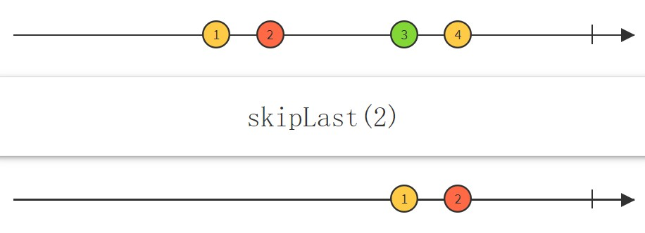

# RxGo——filtering设计说明
## 实现的操作
根据[reactivex.io](http://reactivex.io/documentation/operators.html#filtering)中关于filter的介绍，我们要实现的操作如下：
  

## 具体设计
### 1.准备工作
#### (1) 定义filOperator
根据transforms.go中transOperator的定义：
  
模仿定义如下：
```
type filOperator struct {
	opFunc func(ctx context.Context, o *Observable, item reflect.Value, out chan interface{}) (end bool)
}
```

####  (2) 添加共享变量
在rxgo.go中的Observable添加一些共享变量，能够方便我们之后操作的实现。


#### (3) op函数
也是大部分从transform.go模仿而来，但是增加了一些操作用于实现后面的last、takelast等操作。
```
type filOperator struct {
	opFunc func(ctx context.Context, o *Observable, item reflect.Value, out chan interface{}) (end bool)
}

func (filop filOperator) op(ctx context.Context, o *Observable) {
	// must hold defintion of flow resourcs here, such as chan etc., that is allocated when connected
	// this resurces may be changed when operation routine is running.
	in := o.pred.outflow
	out := o.outflow
	//fmt.Println(o.name, "operator in/out chan ", in, out)
	var wg sync.WaitGroup

	if o.computation {
		go func() {
			for {
				select {
				case <-ctx.Done():
					return
				case <-time.After(o.sample_time):
					if o.flip != nil {
						buffer, _ := o.flip.([]interface{})
						for _, v := range buffer {
							o.sendToFlow(ctx, v, out)
						}
						o.flip = nil
					}
				}
			}
		}()
	}

	go func() {
		end := false
		for x := range in {
			if end {
				continue
			}
			// can not pass a interface as parameter (pointer) to gorountion for it may change its value outside!
			xv := reflect.ValueOf(x)
			// send an error to stream if the flip not accept error
			if e, ok := x.(error); ok && !o.flip_accept_error {
				o.sendToFlow(ctx, e, out)
				continue
			}
			// scheduler
			switch threading := o.threading; threading {
			case ThreadingDefault:
				if filop.opFunc(ctx, o, xv, out) {
					end = true
				}
			case ThreadingIO:
				fallthrough
			case ThreadingComputing:
				wg.Add(1)
				go func() {
					defer wg.Done()
					if filop.opFunc(ctx, o, xv, out) {
						end = true
					}
				}()
			default:
			}
		}

		if o.flip != nil {
			buffer, _ := o.flip.([]interface{})
			for _, v := range buffer {
				o.sendToFlow(ctx, v, out)
			}
		}

		wg.Wait() //waiting all go-routines completed
		o.closeFlow(out)
	}()
}
```

#### (4) 新建Oberservable
与transform中的newTransformObservable相似，写出newFilterObservable
```
func (parent *Observable) newFilterObservable(name string) (o *Observable) {
	//new Observable
	o = newObservable()
	o.Name = name

	//chain Observables
	parent.next = o
	o.pred = parent
	o.root = parent.root

	//set options
	o.buf_len = BufferLen
	return o
}
```

### 2.实现与测试
在实现各个操作时，模仿transform中也使用了
```
x.operator=xOperator
……
var xOperator=filOperator{
    ……
}
```
#### (1) Debounce
  
Debounce：在释放item后，如果在一段时间内不再释放任何到达的item，在这段时间之后再次弹出一个item。    
实现思路：利用一个o.times计数，每次触发都会+1，在然后让进程睡眠一个规定的time_span，如果o.times改变了则说明有新的数据到达了，如果没有则将这个数据发送出去。    
```
func (parent *Observable) Debounce(timeSpan time.Duration) (o *Observable) {
	o = parent.newFilterObservable("debounce")
	o.times = 0
	o.time_span = timeSpan

	o.operator = debounceOperator
	return o
}

var debounceOperator = filOperator{opFunc: func(ctx context.Context, o *Observable, item reflect.Value, out chan interface{}) (end bool) {
	o.times++
	go func() {
		temp := o.times
		time.Sleep(o.time_span)
		select {
		case <-ctx.Done():
			return
		default:
			if temp == o.times {
				o.sendToFlow(ctx, item.Interface(), out)
			}
		}
	}()
	return false
},
}
```
测试：
```
func TestDebounce(t *testing.T) {
	res := []int{}
	Just(1, 2, 3, 4, 5, 6).Map(func(x int) int {
		switch x {
		case 1:
			time.Sleep(0 * time.Millisecond)
		case 2:
			time.Sleep(11 * time.Millisecond)
		case 3:
			time.Sleep(15 * time.Millisecond)
		case 4:
			time.Sleep(5 * time.Millisecond)
		case 5:
			time.Sleep(12 * time.Millisecond)
		case 6:
			time.Sleep(2 * time.Millisecond)
		}
		return x
	}).Debounce(10 * time.Millisecond).Subscribe(func(x int) {
		res = append(res, x)
	})

	assert.Equal(t, []int{1, 2, 4}, res, "Debounce Test Error!")
}
```
测试结果：

<BR>
#### (2)Distinct
  
Distinct：过滤掉与前面已发送的数据重复的项。  
实现思路：利用一个item_map数组储存该数据是否已经出现过，等下次同样的数据到达的时候就直接拒绝即可。
```
func (parent *Observable) Distinct() (o *Observable) {
	o = parent.newFilterObservable("distinct")
	o.item_map = make(map[string]bool)

	o.operator = distinctOperator
	return o
}

var distinctOperator = filOperator{opFunc: func(ctx context.Context, o *Observable, item reflect.Value, out chan interface{}) (end bool) {
	var str = fmt.Sprintf("%v", item)

	if o.item_map[str] {
		return
	}

	o.item_map[str] = true
	o.sendToFlow(ctx, item.Interface(), out)

	return false
},
}
```
测试：
```
func TestDistinct(t *testing.T) {
	res := []int{}
	Just(1, 2, 3, 1, 2, 4, 4, 5).Distinct().Subscribe(func(x int) {
		res = append(res, x)
	})

	assert.Equal(t, []int{1, 2, 3, 4, 5}, res, "Distinct Error!")
}
```
测试结果：


#### (3) ElementAt
  
ElementAt：发送第n个到达的数据。  
设计思路：利用计数器o.times，当每发送一个数据就+1，当与所设定的n相等时就发送。
```
func (parent *Observable) ElementAt(pos int) (o *Observable) {
	o = parent.newFilterObservable("elementAt")
	o.times = 0
	o.item_num = pos
	o.operator = elementAtOperator
	return o
}

var elementAtOperator = filOperator{opFunc: func(ctx context.Context, o *Observable, item reflect.Value, out chan interface{}) (end bool) {
	if o.times == o.item_num {
		end = o.sendToFlow(ctx, item.Interface(), out)
	}
	o.times++
	return false
},
}
```
测试：
```
func TestElementAt(t *testing.T) {
	res := []int{}
	Just(1, 2, 3, 4, 5, 6).ElementAt(2).Subscribe(func(x int) {
		res = append(res, x)
	})

	assert.Equal(t, []int{3}, res, "ElementAt Error!")
}
```
测试结果：


#### (4)First
  
First：发送第一个到达的数据。
实现思路：也是利用计数器o.times，发送第一个即可。
```
func (parent *Observable) First() (o *Observable) {
	o = parent.newFilterObservable("first")
	o.times = 0
	o.operator = firstOperator
	return o
}

var firstOperator = filOperator{opFunc: func(ctx context.Context, o *Observable, item reflect.Value, out chan interface{}) (end bool) {
	if o.times == 0 {
		o.sendToFlow(ctx, item.Interface(), out)
	}
	o.times++

	return true
},
}
```
测试：
```
func TestFirst(t *testing.T) {
	res := []int{}
	Just(1, 2, 3, 4, 5, 6).First().Subscribe(func(x int) {
		res = append(res, x)
	})

	assert.Equal(t, []int{1}, res, "First Error!")
}
```
测试结果：


#### (5) IgnoreElements
  
IgnoreElements：直接拒绝所有数据。
设计思路：这个最简单，直接返回即可。
```
func (parent *Observable) IgnoreElements() (o *Observable) {
	o = parent.newFilterObservable("ignoreElements")
	o.operator = ignoreElementsOperator
	return o
}

var ignoreElementsOperator = filOperator{opFunc: func(ctx context.Context, o *Observable, item reflect.Value, out chan interface{}) (end bool) {
	return false
},
}
```
测试：
```
func TestIgnoreElements(t *testing.T) {
	res := []int{}
	Just(1, 2, 3, 4, 5, 6).IgnoreElements().Subscribe(func(x int) {
		res = append(res, x)
	})

	assert.Equal(t, []int{}, res, "IgnoreElements Error!")
}
```
测试结果：


#### (6)Last
  
Last：发射最后一个到达的数据。
实现思路：在监听数据的时候把数据缓存起来，到最后利用op中添加的部分发送。
```
func (parent *Observable) Last() (o *Observable) {
	o = parent.newTransformObservable("last")

	o.operator = lastOperator
	return o
}

var lastOperator = filOperator{func(ctx context.Context, o *Observable, x reflect.Value, out chan interface{}) (end bool) {
	var slice []interface{}
	o.flip = append(slice, x.Interface())
	return false
},
}
```
op中添加的：
```
if o.flip != nil {
    buffer, _ := o.flip.([]interface{})
    for _, v := range buffer {
        o.sendToFlow(ctx, v, out)
    }
}
```
测试：
```
func TestLast(t *testing.T) {
	res := []int{}
	rxgo.Just(1, 2, 3, 4, 5, 6).Last().Subscribe(func(x int) {
		res = append(res, x)
	})

	assert.Equal(t, []int{6}, res, "Last Error")
}
```
测试结果：


#### (7) Sample
  
Sample：定时查看Observable，将距离上次采样最近的数据发射。
实现思路： 缓存最新到达的数据，开启调度器，然后在op中新开一个go线程，如果调度器是开启状态，则将缓存中的数据发射并清空缓存。
```
func (parent *Observable) Sample(timespan time.Duration) (o *Observable) {
	o = parent.newTransformObservable("sample")
	o.computation = true
	o.sample_time = timespan
	o.operator = sampleOperator
	return o
}

var sampleOperator = filOperator{func(ctx context.Context, o *Observable, x reflect.Value, out chan interface{}) (end bool) {
	var slice []interface{}
	o.flip = append(slice, x.Interface())
	return false
},
}
```
在op中添加判断调度器开启的部分：
```
if o.computation {
    go func() {
        for {
            select {
            case <-ctx.Done():
                return
            case <-time.After(o.sample_time):
                if o.flip != nil {
                    buffer, _ := o.flip.([]interface{})
                    for _, v := range buffer {
                        o.sendToFlow(ctx, v, out)
                    }
                    o.flip = nil
                }
            }
        }
    }()
}
```
测试：
```
func TestSample(t *testing.T) {
	res := []int{}
	Just(1, 2, 3, 4, 5, 6).Map(func(x int) int {
		switch x {
		case 1:
			time.Sleep(0 * time.Millisecond)
		case 2:
			time.Sleep(3 * time.Millisecond)
		case 3:
			time.Sleep(2 * time.Millisecond)
		case 4:
			time.Sleep(13 * time.Millisecond)
		case 5:
			time.Sleep(7 * time.Millisecond)
		case 6:
			time.Sleep(8 * time.Millisecond)
		}
		return x
	}).Sample(10 * time.Millisecond).Subscribe(func(x int) {
		res = append(res, x)
	})

	assert.Equal(t, []int{3, 4, 5, 6}, res, "Sample Error!")
}
```
测试结果：


#### (8) Skip
  
Skip：跳过前n项数据，只发射后面到达的数据。
实现思路：利用o.times计数，只有到了n之后才开始发射数据。
```
func (parent *Observable) Skip(num int) (o *Observable) {
	o = parent.newFilterObservable("skip")
	o.times = 0
	o.skip_num = num
	o.operator = skipOperator
	return o
}

var skipOperator = filOperator{func(ctx context.Context, o *Observable, item reflect.Value, out chan interface{}) (end bool) {
	o.times++
	if o.times <= o.skip_num {
		return
	} else {
		o.sendToFlow(ctx, item.Interface(), out)
	}
	return false
},
}
```
测试：
```
func TestSkip(t *testing.T) {
	res := []int{}
	Just(1, 2, 3, 4, 5, 6).Skip(2).Subscribe(func(x int) {
		res = append(res, x)
	})

	assert.Equal(t, []int{3, 4, 5, 6}, res, "Skip Error!")
}
```
测试结果：


#### (9)SkipLast
  
SkipLast：跳过后n项数据，只发射前面到达的数据。
实现思路：将到达的数据存起来，当存储数据的个数超过要跳过的个数时，当下一个数据到达的时候就发出存储的第一个数据（此时已经保证了第一个数据不会是最后n个）
```
func (parent *Observable) SkipLast(num int) (o *Observable) {
	o = parent.newFilterObservable("skipLast")
	o.times = 0
	o.skip_last_num = num
	o.last = nil
	o.operator = skipLastOperator
	return o
}

var skipLastOperator = filOperator{func(ctx context.Context, o *Observable, item reflect.Value, out chan interface{}) (end bool) {
	o.times++
	o.last = append(o.last, item.Interface())

	if o.times > o.skip_last_num {
		o.sendToFlow(ctx, o.last[0], out)
		o.last = o.last[1:]
		//fmt.Println(o.last)
	}

	return false
},
}
```
测试：
```
func TestSkipLast(t *testing.T) {
	res := []int{}
	Just(1, 2, 3, 4, 5, 6).SkipLast(3).Subscribe(func(x int) {
		res = append(res, x)
	})

	assert.Equal(t, []int{1, 2, 3}, res, "SkipLast Error!")
}
```
测试结果：


#### (10)Take
  
Take：取前几个元素发射。
实现思路：利用计数器o.times，当o.times小于n时就发射，否则直接跳过。
```
func (parent *Observable) Take(num int) (o *Observable) {
	o = parent.newFilterObservable("take")
	o.times = 0
	o.take_num = num
	o.operator = takeOperator
	return o
}

var takeOperator = filOperator{func(ctx context.Context, o *Observable, item reflect.Value, out chan interface{}) (end bool) {
	o.times++

	if o.times > o.take_num {
		return
	} else {
		o.sendToFlow(ctx, item.Interface(), out)
	}

	return false
},
}
```
测试：
```
func TestTake(t *testing.T) {
	res := []int{}
	Just(1, 2, 3, 4, 5, 6).Take(2).Subscribe(func(x int) {
		res = append(res, x)
	})

	assert.Equal(t, []int{1, 2}, res, "Take Error!")
}
```
测试结果：


#### (11)TakeLast
  
TakeLast：选取后n个数据，丢弃前面的。
实现思路：和前面的last实现类似，缓存后n个数据，在执行结束之后再通过op发射。
```
func (parent *Observable) TakeLast(num int) (o *Observable) {
	o = parent.newFilterObservable("takeLast")
	o.times = 0
	o.take_last_num = num
	o.operator = takeLastOperator
	return o
}

var takeLastOperator = filOperator{func(ctx context.Context, o *Observable, item reflect.Value, out chan interface{}) (end bool) {
	o.last = append(o.last, item.Interface())

	if o.times < o.take_last_num {

		//o.sendToFlow(ctx, o.last[o.times], out)

	} else {
		o.last = o.last[1:]
	}
	//fmt.Println(o.last)

	o.times++

	o.flip = o.last

	return false
},
}
```
测试：
```
func TestTakeLast(t *testing.T) {
	res := []int{}
	Just(1, 2, 3, 4, 5, 6).TakeLast(2).Subscribe(func(x int) {
		res = append(res, x)
	})

	assert.Equal(t, []int{5, 6}, res, "TakeLast Error!")
}

```
测试结果：


### 集成测试
将上面所有测试同时运行：
